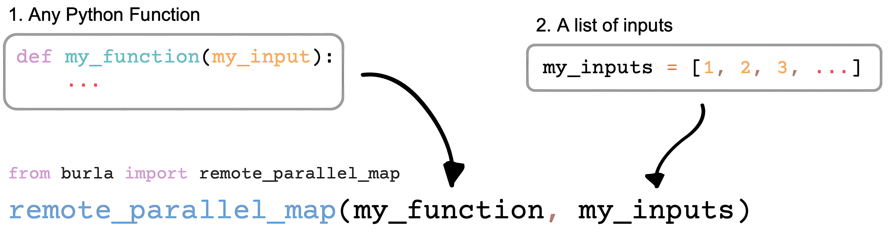

  

    
    <h4>Burla is a python package that makes it incredibly simple to run code on other computers.</h4>
    
Burla only has one function:  <code>remote_parallel_map</code>. 
    This function only requires two arguments, here's how it works:

      
    
      
    
In this example Burla will execute <code>my_function</code> on every input in <code>my_inputs</code>, at the same time, each on a separate computer in the cloud. 
    Burla is <b>fast</b> and <b>scalable</b>. Code starts running within <u>1 second</u> of calling <code>remote_parallel_map</code> on up to <u>1000 CPU's</u>.
      
    The goal of Burla is to make it completely seamless to run code on any hardware, in any environment, everything should <i>just work</i>™. 
    Here are some features we'll need:
    

    <ul style="display: inline-block; text-align: left; padding-left: 0;">
        <li>🐳 Docker Support: Run code in any docker image by passing <code>image=&lt;image-uri&gt;</code>.</li>
        <li>⚙️ GPU Support: Run code on GPU-enabled machines by passing <code>gpu="A100"</code>.</li>
        <li>👨‍💻 Local Developer Experience:</li>
            <ul>
                <li>Errors on remote computers are re-raised locally.</li>
                <li>stdout/stderr streamed back to your local machine.</li>
            </ul>
        <li>📦 Packages Sync Automatically: Local python environment quickly cloned on remote machines.</li>
        <li>💾 Simple Network Storage: </li>
            <ul>
                <li>Remote machines attached to the same fast, persistent, network disk.</li>
                <li>Manage files in your disk through a simple CLI: <code>> burla nas upload/download/ls/rm ...</code></li>
            </ul>
        <li>⚡ Always fast: Images, and environments should be cached to maintain &lt; 1 second latency.</li>
        <li>🔧 Simple Installation: Setup burla in your cloud with one command: <code>> burla install gcp/aws</code></li>
    </ul>
      
    

    Burla is currently under devlopment and is not ready to be used. 
    To sign up for our waitlist go to <a href="https://burla.dev/">burla.dev</a>
    

